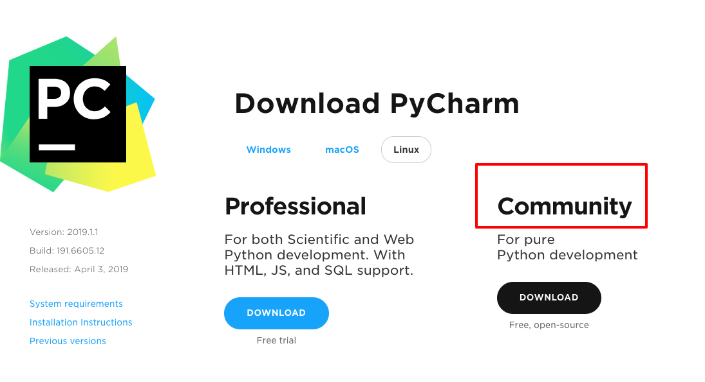

# 实验四：基础开发调试

## REPL:命令行交互解释开发

如上一章，我们可以在交互式解释环境下进行代码的开发调试，但是显然这样的方法效率很低，只适合于初学者认识MicroPython的环境以及模块。

虽然`REPL` 也提供了粘贴模式运行代码，但是对于大型的代码调试，仍然不是高效的方法。

因此，这种交互解释方式，只适合学习环境下使用，在生产环境下应该采用其他更为高效的编辑器和IDE。

## 代码编辑器与源代码管理

常见的流行编辑器包括：

- Pycharm (python)
- Vs code (各种语言)
- Arduino (物联网语言开发)

常见的适用于micropython的代码管理工具

- [Ampy](amby.md)
- [Rshell](rshell_usage.md)
- [mpfshell](mpfshell_usage.md)

###  利用pycharm community编辑代码

#### 下载编辑器

本手册在使用Python编程时建议使用pycharm进行代码编辑。pycharm因为是商业软件，不能直接使用，我们这里采用 pycharm community 版本，该版本免费开放，已经够我们实验使用，请前往[下载](https://www.jetbrains.com/pycharm/download/#section=linux)。



#### 配置编辑器

有关pycharm的具体使用参见[Pychar 环境下Mciropython的开发配置](basic_develop_debug.md), 本节课不用配置，只需要书写代码，体验其特性即可。

#### 编写代码

利用这个编辑器，编写一个让蓝灯交闪烁的代码，将其命名为`main.py`。

参考代码如下：请认真分析一下参考代码的每一句。

```python
import utime
import machine

# 声明一个引脚 例如 D13 作为LED的引脚
led_pin = machine.Pin(2, machine.Pin.OUT)

while True:
# 点亮LED -> 高电平
led_pin.value(1)
# 延时 500ms
utime.sleep_ms(500)
# 关闭LED -> 低电平
led_pin.value(0)
# 延时500ms
utime.sleep_ms(500)
```

### 管理代码

#### 利用ampy管理代码

Ampy 上传文件到开发板

```shell
ampy --port /dev/ttyUSB0 put main.py
```

上传完成后，观察开发板的蓝灯是否交替闪烁，如果不成功，请修改代码重新上传。

#### 利用rshell管理代码


### 提高练习

请根据以上的实验内容，修改代码，要求将闪烁LED灯的功能封装到另一个文件中，如led_blink.py, 由main.py来调用。

## 定制IDE

IDE的功能更为强大，他不但能编辑，调试，同时还能烧录文件等。因为ESP32位比较新的芯片，因此配套的IDE还不是很成熟，主要有以下几种

- Pycharm + micropython plugin
- **Pycharm + microPython Plugin + rshell**
- PlatformIDE
- Arduino IDE
- [thonny](https://randomnerdtutorials.com/getting-started-thonny-micropython-python-ide-esp32-esp8266/)
- [uPyCraft](https://randomnerdtutorials.com/getting-started-thonny-micropython-python-ide-esp32-esp8266/)

> **注意**
>
> 本实验手册重点在使用python开始时，使用pycharm
>
> 当使用c或arduino开发时，采用platformIO。

下一次实验我们将重点演练`Pycharm + microPython Plugin + rshell`