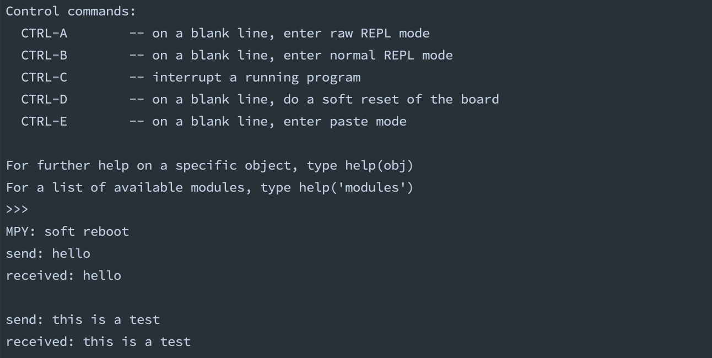

# 串行总线

## 串行总行分类

- UART
- I2C
- SPI

## 本节实验内容

- 了解ESP32 UART硬件资源
- 实验测试MicroPython中与UART相关的API

## 硬件资源

NodeMCU-32S开发板中有三组支持串口的GPIO：


第一组是 TX0 和 RX0，这一组串口资源被REPL所占用，所以无法被用户所使用。

| 组号 | RX     | TX     |
| :--- | :----- | :----- |
| 0    | GPIO3  | GPIO1  |
| 1    | GPIO9  | GPIO10 |
| 2    | GPIO16 | GPIO17 |

不同于其他MicroPython开发板，**ESP32还可以自定义GPIO作为UART**，只要该GPIO满足以下关系：

- 作为TX的GPIO能够进行输出
- 作为RX的GPIO能够作为输入

显然，**几乎所有符合条件**的GPIO都可以作为串口的输入 RX，

除了34,35,36,39这四个GPIO只能作为输入外，其余所有的GPIO**理论上**都可以作为输出 TX

## UART的API文档

### UART构造器

导入`UART` 模块

```
from machine import UART
```

`UART`对象的构造器函数：

```
UART(id, baudrate, databits, parity, rx, tx, stopbit, timeout)
```

| 参数       | 描述                                                         |
| :--------- | :----------------------------------------------------------- |
| `id`       | 串口编号,可用的UART资源只有两个， id有效取值为 `1`,`2`       |
| `bandrate` | 波特率，常用波特率为：`9600` `115200`, 默认为`9600`          |
| `databits` | 数据位，是通信中的真正有效信息的每一个字节单元所包含的比特位数。可选的值为 `6`, `7`, `8`, `9`,默认`8` 。 数据位的位数由通信双方共同约定，一般可以是6位、7位或8位，比如标准的ASCII码是0~127（7位），扩展的ASCII码是0~255（8位） |
| `parity`   | 基础校验方式 ，`None`不进行校验，`0` 偶校验 `1`奇校验        |
| `rx`       | 接收口的GPIO编号                                             |
| `tx`       | 发送口的GPIO编号                                             |
| `stop`bit  | 停止位个数, 有效取值为`1` ,`2`， 默认值为`1`                 |
| `timeout`  | 超时时间，取值范围： `0 < timeout ≤ 2147483647`              |

#### 使用ID直接构造

上面我们说过，UART的id只能取`0，1，2`的，我们可以通过id来直接构造这三组串口：

```python
>>> from machine import UART
>>> a = UART(0)
Traceback (most recent call last):
  File "<stdin>", line 1, in <module>
ValueError: UART(0) is disabled (dedicated to REPL)
>>> a = UART(3)
Traceback (most recent call last):
  File "<stdin>", line 1, in <module>
ValueError: UART(3) does not exist
```

以上的代码证明，我们确实无法使用第0组UART资源，他被REPL所占用，以及我们无法给串口id赋予大于2的`id`

构造第一组串口资源：

```
>>> b = UART(1)
>>> b
UART(1, baudrate=115201, bits=8, parity=None, stop=1, tx=10, rx=9, rts=-1, cts=-1, timeout=0, timeout_char=1)
>>>
```

构造第二组串口资源：

```python
>>> c = UART(2)
>>> c
UART(2, baudrate=115201, bits=8, parity=None, stop=1, tx=17, rx=16, rts=-1, cts=-1, timeout=0, timeout_char=1)
>>>
```

我想细心的你已经发现，我们只需要简单的传入`id`为1或2即可初始化构造出我们的两组串口硬件资源，`tx`和`rx`的`GPIO`编号都打印了出来，和上文中的硬件资源表格中笔者的标注是一一对应的。

**默认的波特率为115201，近似约等于115200，这个数值取决于各个芯片的精度，介于UART的协议存在一定的容错空间，我们将默认的波特率视为115200即可**

#### 更改管脚映射的构造

可能有时候你的需要使用别的管脚，不希望使用默认的GPIO资源。

以13号GPIO和12号GPIO编号为例，我们修改`rx`和`tx`的管脚映射，来构造一个`UART`对象：

```python
from machine import UART
d = UART(2, baudrate=115200, rx=13, tx=12, timeout=10)
```

### 函数

在接下来的示例中, 我们构造`id=1`的`uart`对象来列举UART对象的函数。

```python
uart = UART(1)
```

#### uart.read(length)

函数说明：从串口读取指定长度的数据并返回，若长度未指定则读取所有数据。

`length`: 读入的字节数

示例：

```python
>>> uart.read(10)         # 读入10个字符
```

#### uart.readline()

函数说明：从串口读取一行数据

示例：

```pyton
>>> uart.readline()      # 读入一行
```

#### uart.readinto(buf)

函数说明：读入并且保存到缓冲区

`buf`: 缓冲区

示例：

#### uart.write(data)

函数说明：向串口写入（发送）数据，返回data的长度

`data`: 需要写入（发送）的数据

示例：

```
uart.write('abc')    # 向串口写入3个字符abc
```

#### uart.any()

函数说明： 检查是否有可读的数据，返回可读数据的长度

示例：

```
uart.any()          # returns the number of characters waiting
```

## ESP32串口自发自收实验

**接线 将开发板的第二组UART引脚用杜邦线相连接**

```python
from machine import UART
from machine import Timer
import select
import time


uart = UART(2)

# 创建一个Timer，使用timer的中断来轮询串口是否有可读数据
timer = Timer(1)
timer.init(period=50, mode=Timer.PERIODIC, callback=lambda t: read_uart(uart))


def read_uart(uart):
    if uart.any():
        print('received: ' + uart.read().decode() + '\n')


if __name__ == '__main__':
    try:
        for i in range(10):
            uart.write(input('send: '))
            time.sleep_ms(50)
    except:
        timer.deinit()
```

参考以上代码，请完成如下工作：

1. 将以上文件存储为main.py，上传到开发板运行，进入REPL，从串口输入内容，并观察串口输出。
2. 将以上代码改造为模块，在main中调用，上传到开发板运行，进入REPL，从串口输入内容，并观察串口输出。
3. 自定义GP1O12位发送，GPIO13位接受，修改代码重新完成上述实验。

下图为示例输出：

