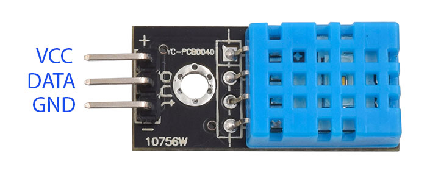

# 检测DHT传感器数据并通过TCP上传

## 实验要求

1. 练习通过micropython获取DHT11的温湿度数据
2. 结合上一节实验，将检测到的温湿度数据通过tcp协议上传到服务器。

## 实验所需器件

- DHT11
- NodeMcu32-S
- MicroUSB数据线

## DHT11简介

### 器件基本介绍

DHT11数字温湿度传感器是一款含有已校准数字信号输出的温湿度复合传感器，它应用专用的数字模块采集技术和温湿度传感技术，确保产品具有极高的可靠性和卓越的长期稳定性。传感器包括一个电阻式感湿元件和一个NTC测温元件，并与一个高性能8位单片机相连接。因此该产品具有品质卓越、超快响应、抗干扰能力强、性价比极高等优点。每个DHT11传感器都在极为精确的湿度校验室中进行校准。校准系数以程序的形式存在OTP内存中，传感器内部在检测信号的处理过程中要调用这些校准系数。单线制串行接口，使系统集成变得简易快捷。超小的体积、极低的功耗，使其成为该类应用中，在苛刻应用场合的最佳选择。

### 硬件接口

**DHT11硬件接口以及引脚定义**



### 硬件接线

ESP32中，**任何一个GPIO接口都可以作为DATA数据接口**，VCC与+5V，GND相连。

### 软件定义

ESP32的Micropython库直接支持DHT。软件操作如下，以DATA与GPIO16相连为例：

```python
import machine
import dht

d = dht.DHT11(machine.Pin(16))
d.measure()
d.temperature() 
d.humidity()    
```


## 通过socket 将检测温湿度上传到服务器。

- 以NodeMCU32-S为socket客户端，PC机为socket server端，
- 客户端检测DHT11的实时温湿度数据，每隔500ms向服务端(server)上传。
- PC机的客户端使用PYHTON3编程，监听端口999，当接收到客户端数据后在打印检测数据。

> socket编程请参见**[Socket通信](socket_communication.md)**，请注意，本实验与socket通信试验的客户端和服务端的定义相反。

