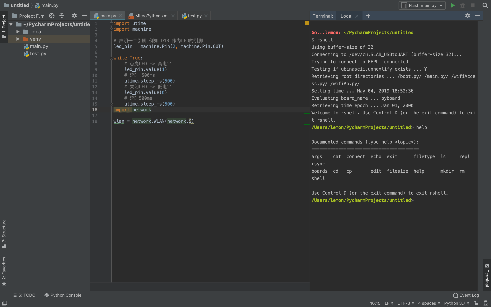

# 实验五：Pychar 环境下Mciropython的开发配置 

PyCharm 是 [JetBrains](https://www.jetbrains.com/) 推出的专业级 Python IDE。Microduino 即将推出支持 [Micropython](http://micropython.org/) 的 ESP32 核心，本文介绍如何在pycharm下配置microPython开发环境

## 前置条件

### 确认Python环境为3.5 以上版本


```shell
python3 --version
# 如果版本太低，请升级版本
sudo apt-get update
sudo apt-get upgrade python3
# 如果系统没有安装python3，请执行以下操作安装
sudo apt-get install python3
```

### 下载安装Pycharm以及micro python插件

Pycharm 有商业版本也有社区的开源版本，这里我们使用开源的社区版本（community）。[下载地址在此](https://www.jetbrains.com/pycharm/download)


设置对话框被打开，点击“Plugins”管理插件。要增加新的插件，可以选择“Browse repositories”按钮，打开在线的插件库。在插件库中查找名为“micropython”的插件。然后安装。


安装完插件后，需要重启 Pycharm 生效。

## 创建micropython项目

### 配置开发环境的python版本

创建一个 Pure Python 的项目取名为“esp32”，我们需要将此 PyCharm 项目所使用的 Python 版本从缺省的 Python2 换成 Python3。在菜单中选择“Preference”，然后选择“Project:esp32 / Project Interpreter”，然后，在 Project Interpreter 下拉框中选择 “Python 3.x”。


如果下拉列表中没有 Python3 选项，可以点选“Show All”来增加，点按对话框左下角的“+”，选择“Add Local...”。


选择“System Interpretor”标签，然后选择 Python 3


最后，需要安装micropython需要的依赖包


依次为：

- adafruit-ampy
- docopt
- esptools
- pip 
- pylint
- pyserial
- setuptools

### 配置micropython

接下来继续在“Preference”窗口中对Micropython插件进行设置。选择“Language & Frameworks”，“MicroPython”。然后选中 “Enable MicroPython Support”，然后选择“ESP8266”（没错，暂时这个插件不完全支持 ESP32，所以选择这个 ESP8266），在 “Device path” 中输入你的 ESP32 串口，例如：“/dev/cu.SLAB_USBtoUART”，输入完成后，可以按一下“Detect”按钮检查确认一下。Windows 版本 PyCharm 直接在 Device Path 中 输入串口的名称，如“COM6”，然后按 “Detect”按钮检查确认一下。


设置完成之后，您应该能够在“Tools”菜单中看到 “MicroPython” 选项。如果看不见，请重启一下 PyCharm。


## 代码编写

新建一个项目，并新建文件，可以看到Pycharm的自动补齐是目前MICROPYTHON的IDE里面做的最好的，因此，强烈建议使用pycharm作为代码编辑器。

## 进入REPL

pycharm同样可以进入到repl模式，如下图：


当执行完命令后会看到如下的repl解释环境


## 烧录文件到目标版

可以烧录制定文件到目标版，在要烧录的文件编辑窗口点击右键，在下拉菜单下点击"run flash xxx.py"操作如下图。


### 实际使用方法

由于用于micropython的plug in是针对esp2866开发的，因此对esp32的支持仍然有bug，因此我们为了各取所长，采用了折中的开发配置方案，即：

|              |                                      |
| ------------ | ------------------------------------ |
| 编辑器       | Pycharm + micropython plugin         |
| Repl         | Rshell 或者 mpfshell, 推荐使用rshell |
| 文件烧录管理 | Rshell 或者 mpfshell, 推荐使用rshell |

下图为综合使用的效果：

